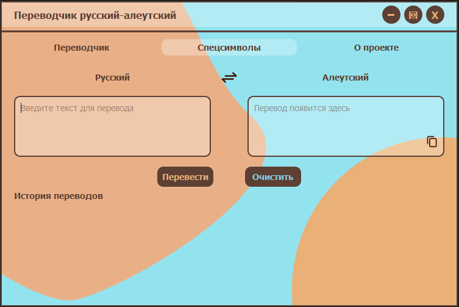
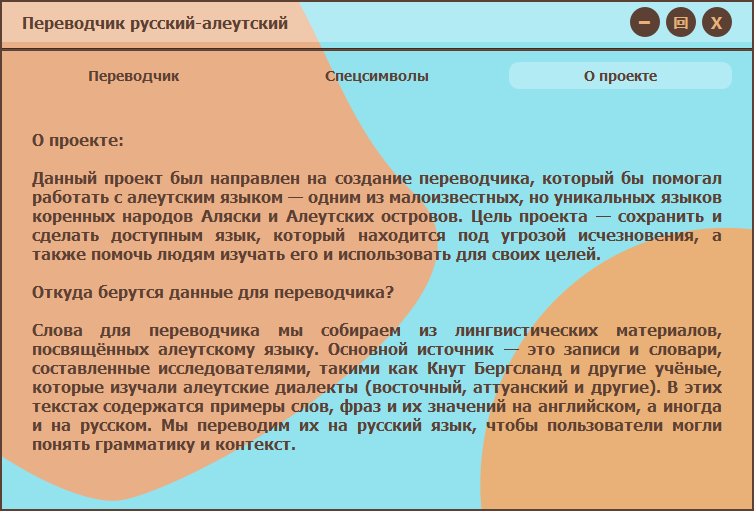
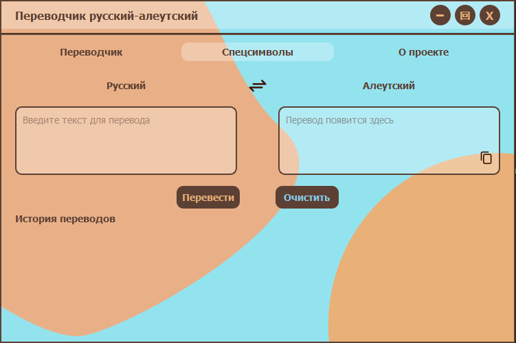

# Переводчик русский-алеутский


**Translator: Russian-Aleutian** — это проект, который включает в себя разработку модели машинного перевода с русского на алеутский язык и графическое приложение для удобного перевода текстов. Модель основана на архитектуре MarianMT из библиотеки `transformers` и обучена на пользовательском наборе данных, содержащем пары переводов «русский — алеутский». Приложение построено с использованием `PyQt5` и предоставляет интуитивно понятный интерфейс для перевода, работы со спецсимволами и просмотра истории переводов.


## Цели проекта
1. **Обучение модели**: Разработать и обучить модель машинного перевода для автоматического перевода с русского на алеутский язык, сохраняя грамматические особенности и лексическую точность.

2. **Приложение**: Создать удобное графическое приложение для перевода текстов с поддержкой спецсимволов (например, `ẍ`), истории переводов и копирования результатов.


## Возможности
- Перевод текста с русского на алеутский язык с использованием обученной модели MarianMT.
- Графический интерфейс на PyQt5 с поддержкой:
  - Переключения языков (русский ↔ алеутский);
  - Копирования переведённого текста в буфер обмена;
  - Отображения истории переводов;
  - Вставки спецсимволов (`x̂`, `ĝ` и `ẍ`);
  - Вкладки «О проекте» с информацией о разработке.
- Кастомизируемый интерфейс с поддержкой стилей через `styles.qss`.


## Структура проекта

- **`model-training\`**: код для обучения модели машинного перевода.
  - `train_model.ipynb`: Jupyter Notebook для обучения модели MarianMT в Google Colab;
  - `russian_aleut_dataset.csv`: датасет с парами переводов;
  - `requirements.txt`: зависимости для обучения модели.

- **`app\`**: код графического приложения.
  - `main.py`: точка входа в приложение;
  - `ui.py`: логика пользовательского интерфейса;
  - `logic.py`: бизнес-логика приложения;
  - `config.py`: конфигурационные параметры;
  - `styles.qss`: стили для интерфейса.

  - `assets\`:
    - `background.svg`: фоновое изображение;
    - `copy_icon.svg`, `copy_icon_hover.svg`: иконки для кнопки копирования;
    - `exchange_icon.svg`, `exchange_hover_icon.svg`: иконки для кнопки смены языков.
    - `requirements.txt`: зависимости для приложения.

- **`screenshots\`**: файл для скриншотов приложения.
- **`.gitignore`**: файл для исключения ненужных файлов.
- **`LICENSE`**: лицензия проекта — GNU General Public License 3.0 (GPL-3.0).


## Исходные данные

### Датасет
- **Файл**: `russian_aleut_dataset.csv`, пока что недоступен в репозитории, так как обновляется для еще большего объема данных для обучения.
- **Лицензия**: Creative Commons Attribution-NonCommercial-NoDerivatives 4.0 International (CC BY-NC-ND 4.0)

- **Поля**:
  - `Russian`: Русская фраза или слово;
  - `Aleut`: Перевод на алеутский язык;
  - `Tag`:
    - bor = заимствованное из русского языка;
    - n = существительное;
    - abs = существительное в единственном числе, абсолютном падеже;
    - v = глагол;
    - num = числительное;
    - adv = наречие;
    - pp = причастие;
    - du = двойственное число: специально для пары вещей/объектов;
    - pl = множественное число;
    - 1 = первое лицо;
    - 2 = второе лицо;
    - 3 = третье лицо;
    - rel = относительный падеж;
    - loc = локатив;
    - abl = аблатив;
    - E = восточный диалект;
    - А = западный диалект.

### Обученная модель
- Модель должна быть сохранена в папку `Marian_aleut_model` и доступна в виде архива `Marian_aleut_model.zip` в разделе [Releases](https://github.com/VitalinaZlo/Translator_Russian-Aleutian/releases), так как вышла слишком большой.
- **Лицензия**: Creative Commons Attribution-NonCommercial-NoDerivatives 4.0 International (CC BY-NC-ND 4.0).


## Установка и запуск

### Требования
- Python 3.6+ (рекомендуется 3.11 для обучения модели и приложения).
- Google Colab с доступом к GPU (для обучения модели)
- Локальная среда для запуска приложения (Windows).

### Готовое приложение
Находится в разработке.

### Обучение модели
1. Загрузите необходимые зависимости из файла `model-training\requirements.txt` и `model-training\russian_aleut_dataset.csv` в Google Colab

2. Откройте `train_model.ipynb` в Google Colab:
    - Загрузите файл `russian_aleut_dataset.csv` в Colab;
    - Выполните ячейки ноутбука по порядку.

3. После выполнения ноутбука архив `Marian_aleut_model.zip` будет автоматически скачан. Вы также можете скачать его из раздела [Releases](https://github.com/VitalinaZlo/Translator_Russian-Aleutian/releases).

### Запуск приложения
1. Перейдите в папку `app\`:
    ```bash
    cd app
    ```

2. Установите зависимости:
    ```bash
    pip install -r requirements.txt
    ```

3. Запустите приложение:
    ```bash
    python main.py
    ```


## Принцип работы

### Обучение модели
Ноутбук `model-training\train_model.ipynb` выполняет следующие шаги:

1. Установка зависимостей (`transformers`, `torch`, `pandas`, `datasets`);
2. Загрузка данных из `russian_aleut_dataset.csv` в `pandas.DataFrame`;
3. Преобразование данных в формат `datasets.Dataset`;
4. Разделение на обучающую (90%) и тестовую (10%) выборки;
5. Инициализация модели и токенизатора MarianMT (`Helsinki-NLP\opus-mt-ru-en`);
6. Добавление спецсимвола ẍ в токенизатор;
7. Предобработка данных с помощью функции `preprocess_function`;
8. Настройка параметров обучения через `TrainingArguments`;
9. Обучение модели с использованием `Trainer`;
10. Сохранение модели в папку `Marian_aleut_model` и создание архива `Marian_aleut_model.zip`;
11. Тестирование модели на примерах.

Функции:

1. **preprocess_function(examples) -> dict**
    
    Эта функция токенизирует входные данные и подготавливает их для обучения модели.
    Основные шаги:
    * Токенизация русских фраз (`source`) с максимальной длиной 128 токенов;
    * Токенизация алеутских переводов (`target`) в режиме целевого токенизатора;
    * Добавление меток (`labels`) в выходной словарь для обучения.
      
2. **translate(text) -> str**
   
   Функция выполняет перевод текста с русского на алеутский с использованием обученной модели.
   Основные шаги:
    * Токенизация входного текста с возвращением тензоров `PyTorch`;
    * Генерация перевода с использованием параметров `max_length=128`, `num_beams=5`, `early_stopping=True`;
    * Декодирование токенов в строку с удалением специальных символов;
    * Постобработка пробелов перед ẍ для корректного отображения.

### Приложение
Приложение в папке `app\` предоставляет графический интерфейс для перевода:

1. Поле ввода для текста на русском языке;
2. Поле вывода для перевода на алеутский язык;
3. Кнопки для перевода, очистки полей, копирования текста;
4. История переводов с возможностью выбора записи;
5. Поддержка спецсимволов (`x̂`, `ĝ`, `ẍ`) через всплывающее меню;
6. Вкладка «О проекте» с описанием;
7. Кастомный дизайн с использованием SVG-иконок и стилей (`styles.qss`).


## Скриншоты

### Главное окно приложения


### Вкладка «О проекте»


### Окно с вплывающим меню спецсимволов



## Лецензия
Этот проект распространяется под лицензией [GNU General Public License 3.0 (GPL-3.0)](LICENSE).

### Примечание об использовании
Хотя этот проект лицензирован под GPL-3.0, автор просит пользователей воздержаться от коммерческого использования без предварительного согласования. Если вы хотите использовать проект в коммерческих целях, пожалуйста, свяжитесь со мной: <vikazlobova@yandex.ru>.
